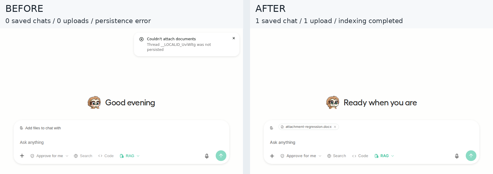

# PR #11838: Playwright A/B evidence

[Source PR](https://github.com/unslothai/unsloth/pull/11838)

The same DOCX attachment scenario, running the real Studio frontend/backend:

| | Before | After |
|---|---|---|
| New saved chat rows | 0 | 1 |
| Uploads | 0 | 1 |
| Result | Exact 'Thread __LOCALID_… was not persisted' error | Document indexed successfully, 1 chunk |

Before: `df946e0864d2ccf05dfb00193fb79c80d7e48996`. After: the same base plus the fix now committed as `49efe3134a1dcdc29cdc28f5b0b1e23f12d3b401`.

36 Playwright scenarios passed across Chromium, Firefox and WebKit. 357 related frontend tests passed. Adversarial coverage includes delayed/failed saves, navigation during persistence, deleted chats, duplicate selections, batch uploads, Temporary Chat and shared/private project ownership.

The composite uses matching fixed crops with added labels. Unedited full screenshots are [before.png](before.png) and [after.png](after.png). Randomized greeting text is not evidence of the fix. [Machine-readable facts](facts.json).

Actual Windows/Tauri OS drag-and-drop was not exercised; its native-intent handler has component coverage. Browser drops use a separate path. No chat generation was tested.
