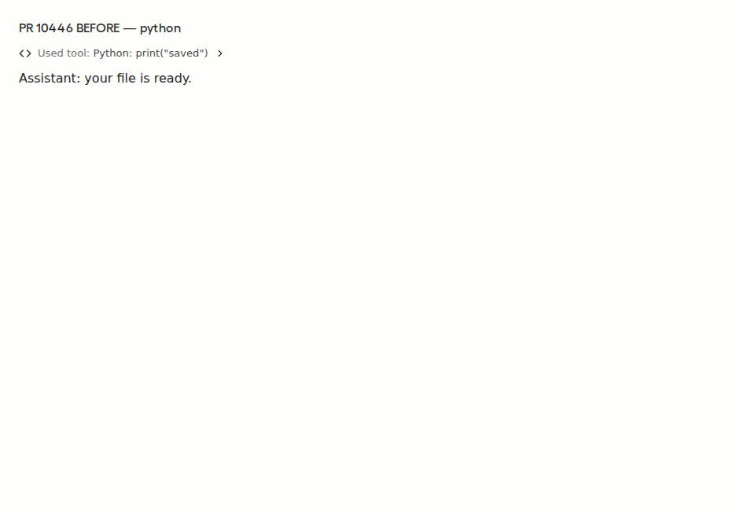
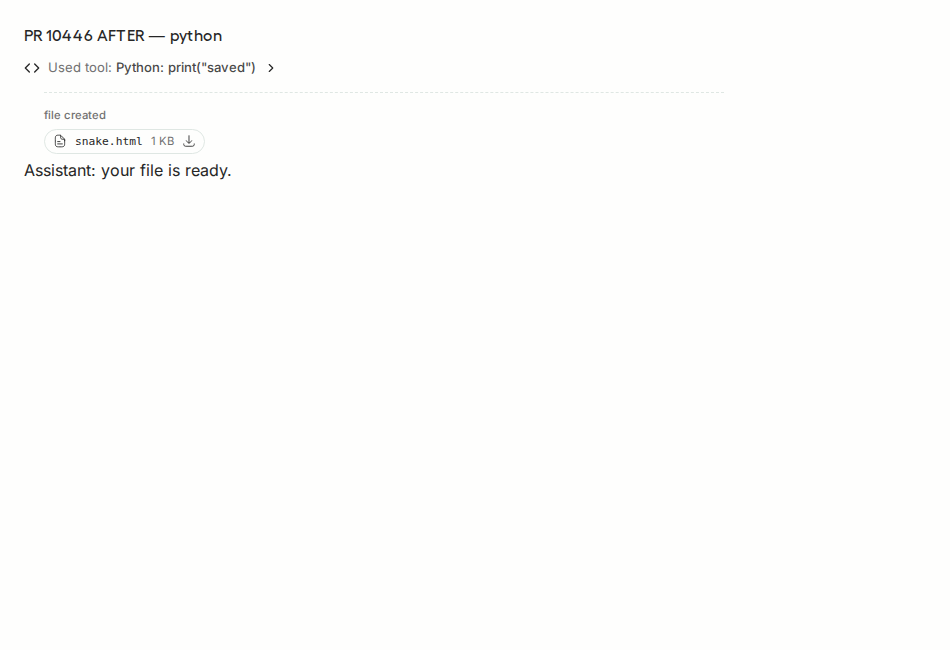

# PR 10446 A/B evidence

Production Python tool-card components rendered through an assistant-ui fixture in Playwright Chromium. Deterministic saved tool result, default collapsed activity.

BEFORE: 2e6db0c1289da4eefdb7d819ba6eb4523704a6a8
AFTER: 575cddb036eb82ae2f91a25514c701cef8837983

Before: no visible download button. After: snake.html download remains visible.

These images establish the original individual-card fix. They do not validate later commits or the grouped-Terminal follow-up. No live backend or model execution is pictured.

