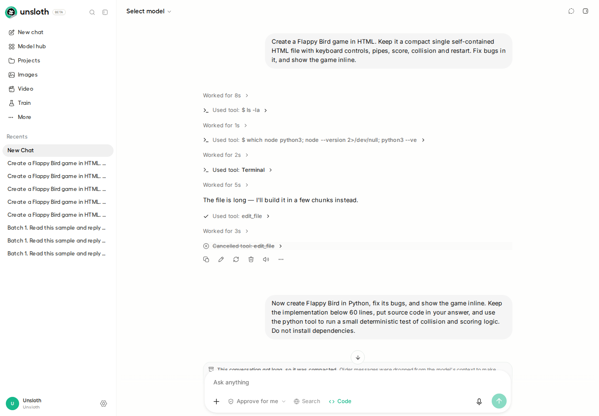
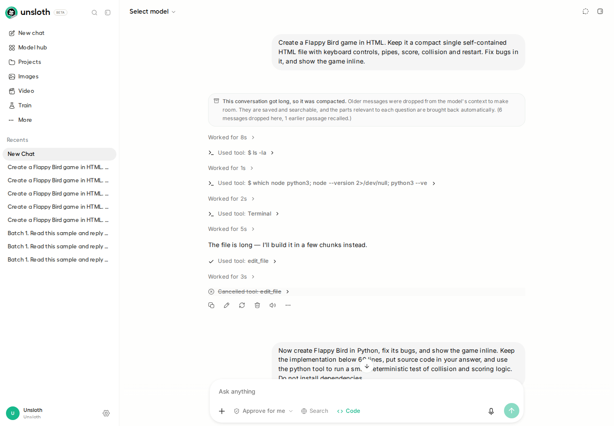

# PR #11702: fresh Playwright comparison

BEFORE: merge base `ebf2f2a5d4c78407bce5a38988d38198c094ef2a`. AFTER: PR head `b9296795ed1861d6238d67104c26749b74048c51`.

Separate installations reopen independent copies of the same recorded real-model conversation. First tool reply notice counts: **0 → 1**, retained after reload. This is a fresh rendering comparison, not a fresh inference run. See [metadata](meta.json) and [DOM facts](facts.json).

## BEFORE — first tool reply has no notice

## AFTER — first tool reply shows the notice

