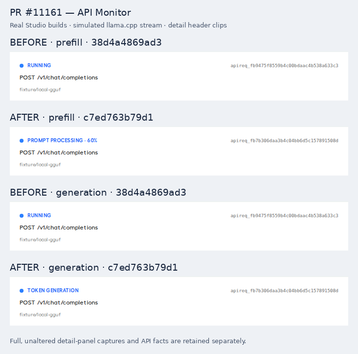

# PR #11161 validation evidence

This staging branch contains review-only validation and evidence for [unslothai/unsloth#11161](https://github.com/unslothai/unsloth/pull/11161).

BEFORE: `38d4a4869ad3173ba7cad99682f5c8726e72f14d`

AFTER: `c7ed763b79d163eb295b65e2b343b856821920e7`

## Visible result

The comparison uses real, separately built Studio frontends and a simulated llama.cpp stream. BEFORE shows `running`. AFTER shows `Prompt processing · 60%` for 1,200/2,000 tokens and then `Token generation`.

The composite uses unscaled detail-header clips. Full original captures: [before prefill](before-prefill.png), [after prefill](after-prefill.png), [before generation](before-generation.png), [after generation](after-generation.png).

[Metadata and complete API facts](meta.json) record the SHAs, bundle hashes, build stamps, separate processes/homes/ports, assertions, and field-by-field differences. Local filesystem prefixes are redacted. The composite and full captures were visually inspected.

## Behavioral A/B result

The identical local harness exercises production Studio passthrough and monitor handlers over loopback HTTP. The upstream emits progress only when Studio requests it. It does not fabricate monitor fields, headers, or labels.

| Scenario | BEFORE | AFTER |
| --- | --- | --- |
| Prefill at 1,200/2,000 | No progress fields or correlation header | 60%, prompt-processing phase, matching monitor ID |
| Advancing prefill across initial 2-second deadline | Timeout at 2.032 seconds | Answer completes at 3.544 seconds |
| Legacy stream without progress | Pass | Pass |
| Tool output | Pass | Pass |
| Concurrent subjects / exact foreign request ID | Isolated; HTTP 404 | Isolated; HTTP 404 |
| Frozen prefill / stalled decoding | Times out | Times out |
| Stream cleanup | Zero active rows; upstream generators closed | Zero active rows; upstream generators closed |

Both local runs pass assertions for their expected side. A green BEFORE result means the old limitation is reproduced, not that old code supports the new feature. Setup failures do not count as negative evidence.

The fixture replaces model selection/loading, authentication, and unrelated UI shell endpoints. It tests subject-scoped monitor lookup, not login/authentication middleware. Local runs use Ubuntu under WSL, Python 3.12, and Chromium for UI capture. Real GPU inference and Safari are not covered. `/v1/responses` gains a correlation header in the PR but not live prefill counters on its direct path.

## Broader local review results

- [717 backend regressions passed](head-tests.txt).
- [537 additional and adjacent tests passed](adjacent-tests.txt), including 118 parameterized review probes.
- Matched feature assertions: [five fail before](base-negative.txt), [five pass after](head-ab.txt). One baseline failure is a missing helper argument rather than end-to-end proof; the HTTP harness above provides behavioral A/B evidence.
- [Frontend: 7,750 passed, one failure](frontend-summary.txt). The Arabic shortcut-placeholder failure also [fails on the merge base](frontend-base-negative.txt).
- Frontend typecheck and production build passed locally.

## Targeted native CI

[Workflow](../../../.github/workflows/pr11161-ab.yml) runs the pinned BEFORE and AFTER on Ubuntu, Windows, and macOS. [Harness](../../../.github/scripts/pr11161/run.py), [loopback fixture](../../../.github/scripts/pr11161/server.py), and [extra dependencies](../../../.github/scripts/pr11161/requirements.txt) are included. Each side asserts its expected results, checks identity before importing source, and cleans up its child process.

[Workflow runs](https://github.com/Imagineer99/unsloth/actions/workflows/pr11161-ab.yml) provide actual native-platform results when completed. The prepared/local evidence alone does not establish native Windows/macOS results. CI uploads fixture-only logs and JSON with seven-day retention.
