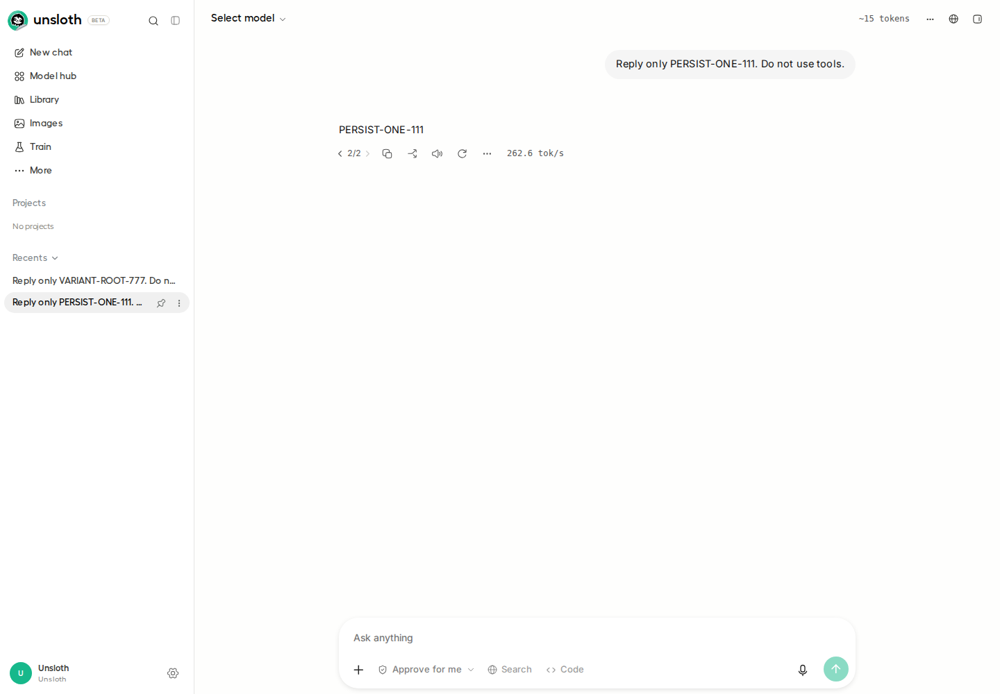
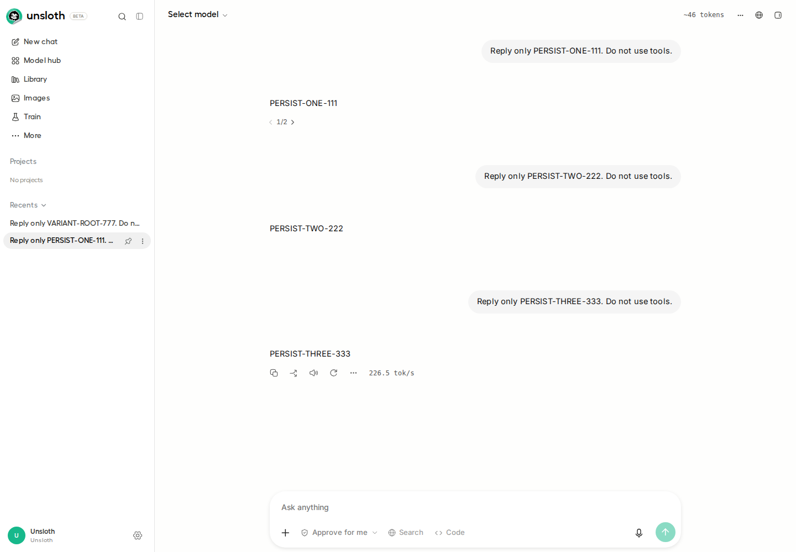
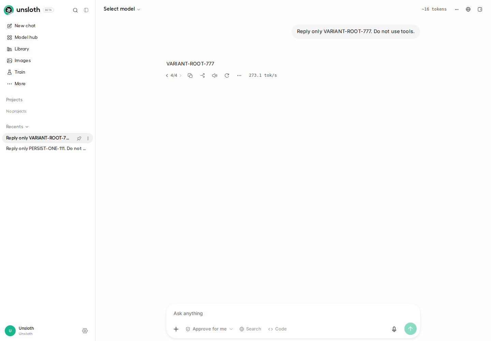
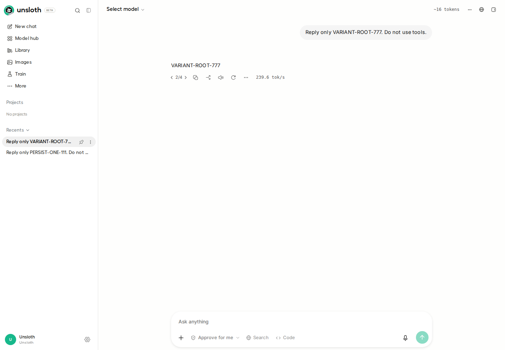

# PR #13109 Playwright A/B evidence

Live local test on 2026-10-09 UTC, using a real Qwen3.5-0.8B UD-Q4_K_XL model.

- Baseline: v0.1.905-beta (`d94ca0ee6b54891378c6de65af9eba48f1afae59`).
- Fixed: PR #13109 at `472a1fe9b23f82ea07032d2567d78b8a85d971a6`.
- Environment: WSL Linux, headless Chromium through Playwright, RTX 5070 Ti.
- Clean source snapshots and separate test databases, reusing installed frontend/backend dependencies and the local llama.cpp build.

## Reproduction

1. Send three ordinary prompts through the real chat UI.
2. Regenerate the first assistant response, then select Previous to return to the original branch (1/2) containing all three exchanges.
3. Create another chat, generate four response variants, then select 2/4.
4. Close the browser, stop and restart the backend, launch a new browser with the saved browser storage, and open each saved chat from the sidebar.

| After restart | Baseline | PR |
| --- | --- | --- |
| Original conversation | Switches to 2/2, only first exchange visible | Remains on 1/2, all three exchanges visible |
| Selected response variant | Switches from 2/4 to 4/4 | Remains on 2/4 |

All 12 message rows remain unchanged in each test database. This demonstrates branch-selection loss, not deletion of stored messages.

## Screenshots after restart

### Baseline


### PR


### Response selection



The matching before-restart screenshots, machine-readable `results.json`, and `targeted-tests.log` are included.

## Targeted tests

15 passed, 0 failed:

```sh
node --experimental-strip-types --test tests/reopened-chat-branch.test.ts tests/saved-branch-head.test.ts tests/finetune-export-branches.test.ts
```

The production frontend build also passed. The packaged desktop shell and prompt-editing scenario were not tested. These results apply to the exact PR commit above, not later updates. This is local execution evidence, not a GitHub Actions run.
